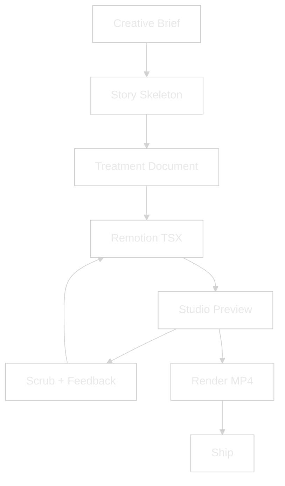
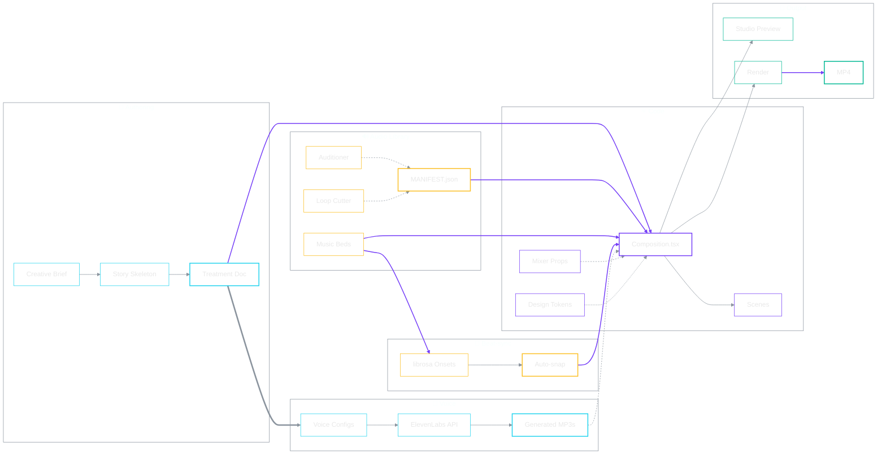
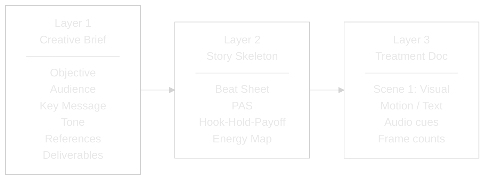
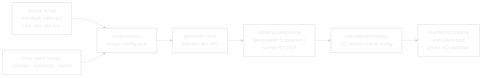
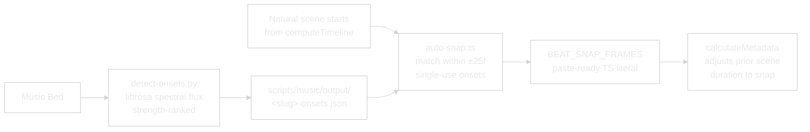

<picture>
  <source media="(prefers-color-scheme: dark)" srcset="assets/logo-dark.svg">
  <source media="(prefers-color-scheme: light)" srcset="assets/logo-light.svg">
  
</picture>

<br/>


**Programmatic video production pipeline.**
**Treatment-driven, Claude-controlled, beat-synced.**

> [!NOTE]
> **TL;DR.** Write a treatment doc, Claude generates Remotion code, scrub in Studio, render MP4. No timeline. No keyframes. No After Effects.

[](#see-it-in-action)
[](#quick-start-once-installed)
[](#companion-repos)

<!-- VIDEOS START -->
### See It In Action

<video src="https://github.com/user-attachments/assets/3da20bdd-eaea-4e96-9a10-a15f2e6de9e7" controls muted></video>

**Production Engine — StackExplainer.** Remotion, Claude, treatment files, ducking, beat sync. What's under the hood.

<video src="https://github.com/user-attachments/assets/758c1b79-dd45-4228-972d-5e9c89586ad7" controls muted></video>

**Video Brief — TreatmentExplainer.** How a treatment doc becomes a rendered MP4, end to end.

### Tutorials

<video src="https://github.com/user-attachments/assets/7a094771-e07b-4f0d-bc4e-bdb51b47574f" controls muted></video>

**Loom 5 — The Workflow (7:08).** End-to-end, treatment to render. Start here if you want the whole picture.

<video src="https://github.com/user-attachments/assets/9d9c4cb4-b86e-4579-a3a9-407338d13e7c" controls muted></video>

**Loom 4 — The Process (6:33).** The meta-walkthrough: how the pipeline thinks, what it ducks, where the seams live.
<!-- VIDEOS END -->

> [!TIP]
> **New here?** The end-to-end recipe lives in [HOW-TO-SHIP-AN-EXPLAINER.md](./HOW-TO-SHIP-AN-EXPLAINER.md) — six steps from treatment to MP4. If you only have time for one video, watch **Loom 5 — The Workflow** above.

---

## Why this exists

Video production has always been tool-first. Open After Effects, open Premiere, start dragging clips. The creative brief lives in someone's head or a Slack thread. By the time the edit is done, nobody remembers what the video was supposed to *do*.

This system flips it. **The treatment is the source code.** You describe what you want in a structured document — who's watching, what they should feel, what each scene shows, what audio plays when. Claude turns that into Remotion code. Remotion turns that into video. Every frame is a React render, every cut is a function call, every audio duck is a volume curve.

The result: anyone who can describe a video can ship one. No timeline. No keyframes. No After Effects license. Just a treatment and a conversation.

---

## Claude Remotion Flow vs Traditional Video Pipelines

| Dimension | After Effects / Premiere | Loom / Descript | Claude Remotion Flow |
|---|---|---|---|
| **Source of truth** | Project file (`.aep` / `.prproj`) | Recording + transcript | Treatment markdown — versioned, diffable, replayable |
| **Animation** | Keyframes by hand | Templates only | `spring()` + `interpolate()` per scene, code-defined |
| **Audio handling** | Manual ducking per clip | Auto-leveling only | `buildMusicVolume()` callback ducks under VO windows |
| **Voice generation** | Record + edit manually | Pre-built voice tools | ElevenLabs cloned voice, regenerated on script change |
| **Beat sync** | Drag clips to peaks manually | Not supported | librosa onset detector + auto-snap helper |
| **Aspect ratios** | Re-edit per ratio | One per recording | Same TSX, render at any size (`--width=` / `--height=`) |
| **Iteration cost** | Re-export per change | Re-record | Hot-reload in Studio, `npm run render` when locked |
| **Collaboration** | `.aep` files in Dropbox | Cloud workspace | Git diff on a treatment doc |
| **License** | Adobe CC subscription | SaaS subscription | MIT (Remotion is free for personal + < $5M revenue) |

---

## What it does



### How the parts connect

The whole repo is one connected graph. Treatment is the spec, every other part exists to render it.

<p align="center">
  
</p>

<sub>Animated SVG. Each spoke pulses from the Treatment hub outward: that's the actual data flow. Six clusters, each a sub-system. Authoring drafts the spec, Code renders it, Voice / Audio / Beat-sync feed sound, Output ships the MP4.</sub>

<details>
<summary><b>Detailed wiring (Mermaid)</b>: every named file, every arrow</summary>

<br/>



Solid lines = data flow into the rendered MP4. Dotted lines = configuration/curation. Treatment Doc is the only entry point — every other arrow downstream of it.

</details>

<details>
<summary><b>The Treatment System (3 Layers)</b> — how intent becomes buildable code</summary>

<br/>

Every video follows three layers. Layer 1 captures intent. Layer 2 gives it structure. Layer 3 makes it buildable.



**Layer 2 — Pick based on what the video needs to do:**

| Skeleton | Use When | Beats |
|---|---|---|
| **Beat Sheet** | Telling a story | Hook → Setup → Turn → Proof → Resolve |
| **Problem-Agitate-Solve** | Selling a product | Problem → Agitate → Solve → Outcome |
| **Hook-Hold-Payoff** | Social retention | Hook 3s → Hold 17s → Payoff 10s |
| **Energy Map** | Audio drives the edit | Intro → Build → Drop → Groove → Resolve |

</details>

---

<details>
<summary><b>Ten Things You Can Do With It</b> — patterns the same engine renders</summary>

<br/>

The pipeline is treatment-driven — the same engine renders any of these. Differences live in the Creative Brief + skeleton choice.

| # | Pattern | What it looks like |
|---|---------|---------------------|
| 1 | **Explainer video** | Break down a product, concept, or framework. VO narration + on-screen text + motion beats. (The shipped `StackExplainer` + `TreatmentExplainer` are examples.) |
| 2 | **Event opener** | Cinematic 30–40s intro for a conference, launch, or livestream. Music-driven, text-first, impact bookends. |
| 3 | **Product launch video** | Structured hero reveal. Problem → Agitate → Solve skeleton. Punchy VO, animated features, CTA card. |
| 4 | **Data-viz clip** | Animated charts + numbers with narration. Remotion renders SVG / HTML natively — no chart library lock-in. |
| 5 | **Social ad / short** | 30–60s Hook-Hold-Payoff cut for TikTok / Reels / Shorts. Vertical 9:16 render, captions burned or ship alongside. |
| 6 | **Animated quote card** | 6–10s pull-quote asset with gradient, grain, and subtle motion. Perfect for LinkedIn / X. |
| 7 | **Tutorial walkthrough** | Step-by-step with VO + on-screen annotations. Captions auto-generated from the transcript. |
| 8 | **Testimonial video** | VO-led customer story with lower-thirds and b-roll cutaways. Music-ducked under voice. |
| 9 | **Course / module trailer** | 60–90s teaser for an online course. Music-driven pacing, hook-first, CTA close. |
| 10 | **Per-subject reel template** | Short 4–10s intro reel per team member, speaker, or artist. One TSX, data-driven by a JSON/CSV feed. |

Each pattern starts with a Creative Brief, picks a skeleton, writes a treatment, and renders. The engine doesn't change — your inputs do.

</details>

---

## Install (via Claude Code)

Paste the repo URL into Claude Code and say:

> "Install Claude Remotion Flow and start the Studio."

Claude will walk you through:

1. **Clone the repo** into a chosen working directory.
2. **Install Node dependencies** — `npm install` pulls 29 Remotion packages + supporting tooling.
3. **Check ffmpeg + ffprobe** — installs via Homebrew (macOS), apt (Linux), or prompts for WSL (Windows). Remotion uses ffmpeg internally for renders; the manifest-doctor uses ffprobe to validate audio integrity.
4. **Bootstrap the audio library** — `npm run library:fetch` downloads every catalogued SFX from its `cdn_url` into `public/assets/sfx/library/`. The MP3s themselves are gitignored — `MANIFEST.json` is the source of truth and is fully recoverable.
5. **Optional: ElevenLabs API key** — copy `.env.example` to `.env`, paste your key. Needed only if you want AI-generated voiceover.
6. **Optional: Python + librosa** — sets up a venv for the onset-detection helper. Needed only if you want beat-sync against a music bed.
7. **Start the Studio** — `npm run dev` opens `localhost:3000` with the shipped example compositions loaded.
8. **Start the Auditioner + Loop Cutter** — `npm run audition` opens both at `localhost:4747` (auditioner root, `/cutter` for the cutter).

If the Studio opens and you can scrub the example compositions, the pipeline is working.

<details>
<summary><b>Manual install</b> — if you prefer to skip Claude Code</summary>

<br/>

| Tool | Purpose | Install |
|------|---------|---------| 
| Node.js 18+ | Runs Remotion | nodejs.org / `brew install node` / `apt install nodejs` |
| `ffmpeg` | Video encoding under the hood | `brew install ffmpeg` (macOS) / `apt install ffmpeg` (Linux) |
| ElevenLabs API key *(optional)* | Cloned-voice VO | Paste into `.env` as `ELEVENLABS_API_KEY` |
| Python 3.12+ + librosa *(optional)* | Beat-sync onset detection | `python -m venv scripts/music/.venv && pip install librosa` |

### First video after install

Once the Studio is running, say to Claude:

> "Help me draft a Creative Brief for a 60-second explainer about *\[your topic\]*."

Claude walks the 3-layer treatment interview, writes the TSX, and you scrub the result in Studio. Render when signed off.

</details>

---

## Quick Start (once installed)

```bash
npm run dev            # Open Studio at localhost:3000
npm run render:stack   # Render the example stack explainer
npm run render:treatment   # Render the example treatment explainer
npm run lint           # ESLint + TypeScript typecheck
```

Select a composition from the Studio dropdown. Scrub the timeline, pause on any frame, hot-reload on code changes. Live mixer sliders (`musicHigh`, `musicDuck`, `sfxIntroVolume`, `sfxOutroVolume`) surface in the right-hand Props panel — drag during playback and the render updates frame-by-frame.


<video src="https://github.com/user-attachments/assets/9594e592-9ff8-4b62-b990-76c8d816192c" controls muted></video>

**Loom 1 — Remotion UI (2:16).** A tour of the Studio interface itself: composition list, timeline scrub, props panel, hot-reload loop. Watch this once before you open the Studio for the first time.

---

<details>
<summary><b>How it works</b> — Treatment → Code → Feedback loop</summary>

<br/>

### 1. Write a Treatment

Start with the Creative Brief (Layer 1):

```markdown
Objective:    Explain [your concept] in 60 seconds
Audience:     [who's watching, what they care about]
Key Message:  One-sentence takeaway
Tone:         Cinematic / conversational / technical / punchy
References:   2–3 videos that feel right
Deliverables: 60s, 16:9 + 9:16 cut
```

Pick a skeleton (Layer 2) — Beat Sheet for story, PAS for selling, Hook-Hold-Payoff for social, Energy Map when music drives the edit.

Write the treatment (Layer 3):

```markdown
SCENE 1 — Hook (0:00–0:05, 150f)
  Visual:  Headline text static at frame 0, explodes outward f35
  Motion:  spring({ damping: 14, stiffness: 130 }) per word
  Text:    Supporting line drops in f40, chromatic aberration
  Audio:   Riser f0–90, impact hit f92
```

### 2. Claude Builds It

The treatment maps directly to Remotion code:

- **Scenes** → `<TransitionSeries.Sequence>` components
- **Chapter cards** → `computeTimeline()` interleaves them before target scenes
- **Motion notes** → `spring()` / `interpolate()` / easing curves
- **Audio cues** → `<Audio>` layers with `volume`, `startFrom`, `endAt`
- **Music ducking** → `buildMusicVolume({ voWindows, musicHigh, musicDuck })` callback
- **Text** → styled divs + `@remotion/layout-utils` for auto-fit
- **Timing** → `durationInFrames` computed from VO MP3 lengths via `calculateMetadata`

### 3. Feedback Loop

Scrub in Studio → give timecode feedback ("at frame 72 the flare is too bright") → Claude edits the TSX → Studio hot-reloads → re-scrub. Only render MP4 when signed off.

</details>

---

<details>
<summary><b>Voice Pipeline</b> — ElevenLabs cloned VO, regenerated on script change <i>(optional)</i></summary>

<br/>

One config file per composition, one MP3 per scene. Bring your own ElevenLabs voice — paste the voice ID into a preset file, lock your stability / similarity / speed, and reuse across every video you ship.



**Tips for voice configs:**

- Em-dashes and commas pace the delivery better than SSML breaks.
- One idea per line in the script file — the MP3 output naturally breathes.
- Lock a preset once you've A/B/C-tested your voice. Reuse across every composition for consistency.

</details>

---

<details>
<summary><b>Audio Beat-Sync</b> — librosa onsets + auto-snap helper <i>(optional)</i></summary>

<br/>

Python / librosa detects phrase-level onsets in a music bed. The auto-snap helper picks the ones that land within a safe window of each natural scene start and emits a paste-ready `BEAT_SNAP_FRAMES` literal.



</details>

---

<details>
<summary><b>What if...</b> — common edge cases (multiple ratios, audio-first, 3D, web embed)</summary>

<br/>

### ...I don't know what video I want?

Start with **References** in the Creative Brief. Find 2–3 videos that *feel* right, share them. Claude extracts the structure, pace, and tone and proposes a skeleton.

### ...the video is audio-first?

Use the **Energy Map** skeleton. Map the music's energy curve (intro → build → drop → groove → resolve), hang visuals on the peaks.

### ...I need multiple aspect ratios?

Remotion renders the same composition at any size. One TSX, multiple outputs:

```bash
npm run render:stack         # 16:9 default
npx remotion render StackExplainer out/stack-9x16.mp4 --width=1080 --height=1920
npx remotion render StackExplainer out/stack-1x1.mp4  --width=1080 --height=1080
```

Use `@remotion/layout-utils` (`fitText`, `measureText`) to auto-scale text per ratio. Scene bodies already target the canvas via `SAFE_INSET_X/Y` — content scales with the composition.

### ...I want to embed the video on a website?

`@remotion/player` embeds any composition as an interactive React component — no MP4 needed. Viewers can scrub and pause in real time.

### ...I need 3D or complex illustrations?

- **Lottie** (`@remotion/lottie`) — After Effects JSON exports. Thousands of free animations on LottieFiles.
- **Three.js** (`@remotion/three`) — Full 3D scenes. Heavy — only when a reel genuinely needs it.
- **Rive** (`@remotion/rive`) — Interactive animations with state machines.

</details>

---

<details>
<summary><b>Directory Structure</b> — repo layout reference</summary>

<br/>

```
claude-remotion-flow/
├── src/
│   ├── Root.tsx                    # Composition registry
│   ├── StackExplainer.tsx          # Example: 8-scene explainer
│   ├── TreatmentExplainer.tsx      # Example: 3-layer framework explainer
│   ├── FormatExplainer.tsx         # Example: cinematic event opener
│   └── explainer-shared/           # Shared composition kit
│       ├── constants.ts            # FPS, pre/post-roll, music levels, SFX bookends
│       ├── tokens.ts               # Colors, fonts, safe-area
│       ├── components.tsx          # SceneBG, SceneExit, TRANS, ChapterCard, FadeToBlack
│       ├── timeline.ts             # computeTimeline() — cards + scenes + transitions
│       ├── metadata.ts             # makeCalculateMetadata(), buildMusicVolume(), MixerProps
│       └── sfx-library.ts          # Generated — typed SFX path constants
├── public/assets/
│   ├── voice/
│   │   ├── generated/<Explainer>/  # ElevenLabs MP3 outputs per composition (gitignored)
│   │   └── reference/              # Voice-clone source audio (gitignored)
│   ├── music/                      # Music beds (gitignored — drop your own)
│   ├── sfx/
│   │   ├── library/                # Indexed SFX (MANIFEST.json tracked, MP3s gitignored)
│   │   └── inbox/                  # New scrapes awaiting curation
│   └── branding/                   # Your logos + brand assets
├── scripts/
│   ├── voice/                      # ElevenLabs VO pipeline (generate-vo.ts)
│   ├── music/                      # Onset detection + auto-snap helper
│   └── sfx/                        # Library scraping + auditioner + shortlist-to-code
├── treatments/                     # Per-composition treatment docs
├── out/                            # Rendered MP4 outputs (gitignored)
├── HOW-TO-SHIP-AN-EXPLAINER.md     # End-to-end cookbook
└── package.json                    # 29 packages, Remotion pinned to 4.0.448
```

</details>

---

## Example Compositions

The repo ships with three example compositions you can study, modify, or use as starting templates.

| ID | File | Length | Pattern |
|---|---|---|---|
| `StackExplainer` | `StackExplainer.tsx` | ~74s (9 scenes) | Multi-scene concept explainer with VO + music bed |
| `TreatmentExplainer` | `TreatmentExplainer.tsx` | ~38s (6 scenes) | Framework walkthrough, treatment-led |
| `FormatExplainer` | `FormatExplainer.tsx` | ~37s | Cinematic event opener, Energy Map skeleton |

Explainer durations are **VO-driven** — `calculateMetadata` reads each scene's MP3 and sizes the scene to `max(VO + padding, fallback)`. Re-generate the VO and the comp length adjusts automatically.

---

## Audio Library

### SFX — categorised + shortlistable

SFX live under `public/assets/sfx/library/` organised by category. Source of truth is `public/assets/sfx/MANIFEST.json` — one entry per file with title, author, tags, license, `cdn_url`, and a `shortlisted` flag.

| Category | Typical use |
|---|---|
| `transitions` | whoosh / sweep variants between scenes |
| `stingers` | short logo stings |
| `risers` | cinematic rising tension |
| `impacts` | booms, hits, crashes |
| `ambience`, `music` | backdrops, drones |

### Bootstrap your library on a fresh clone

> [!IMPORTANT]
> **MP3/WAV files are gitignored — `MANIFEST.json` is the source of truth.** Manifest entries carry the `cdn_url` they came from, so the catalogue is fully recoverable on any clone with one command. Never check audio binaries into git.

```bash
npm run library:fetch                # Download every cdn_url-backed entry into local_path
npm run library:fetch -- --shortlisted-only   # Lighter: only shortlisted items
npm run library:fetch -- --dry-run            # See what would be fetched first
npm run library:doctor               # Verify: 0 missing / 0 empty / 0 unreadable
```

`library:fetch` is idempotent — it skips items that already exist with non-zero size. Re-run any time. Defaults to concurrency 6; tune with `--concurrency <n>`.

**Audition + shortlist workflow:**

```bash
npm run audition                                          # Local auditioner at localhost:4747
                                                          # Loop Cutter at localhost:4747/cutter
node --strip-types scripts/sfx/shortlist-to-code.ts       # Regenerates src/explainer-shared/sfx-library.ts
npm run library:doctor                                    # Sweep the manifest: stat + ffprobe per item
```

`sfx-library.ts` exports typed constants (`SFX_TRANSITIONS.WHOOSH_CINEMATIC`, etc.) plus a flat `SFX_SHORTLIST_BY_ID` index keyed by stable manifest IDs.

<details>
<summary><b>Auditioner — features</b> (11 capabilities, full table)</summary>

<br/>

The auditioner (`localhost:4747`) is the browse + curate surface for the SFX library. Local-only Node server, no external deps beyond stdlib, manifest is the source of truth.

| Feature | What it does |
|---|---|
| **Category tabs** | Six top-level tabs (transitions / stingers / risers / impacts / ambience / music) with a Traktor-style 4px categorical stripe per row — colour matches between auditioner and Loop Cutter. |
| **Music subcategory grouping** | Within Music, items group by `subcategory` (loops, beds, drones, etc.) so you can scan a single sub-bucket without filter gymnastics. |
| **Per-tab search** | Search input scopes to the active tab — title / author / tag. Switch tabs to search elsewhere. Placeholder + tooltip surface the per-tab scope. |
| **Status + duration filters** | Filter by status (`all` / `shortlisted` / `approved` / `rejected`) and duration band. Filters persist in `state.filter` and survive tab switches. |
| **Sticky preview bar** | Top-of-page preview pinned across scrolls. Click any row to load it; play/pause stays in one spot regardless of list position. |
| **Cutter handoff** | Each preview bar has a ✂︎ button — opens the Loop Cutter in a new tab with the file pre-loaded. Auditioner pauses its own preview via `BroadcastChannel('loop-cutter-sync')` so you don't get double-audio. |
| **Staging tray** | Drop items into a tray to assemble a shortlist before committing. Empty tray collapses to a thin 4px strip — out of the way, but discoverable. |
| **Inline notes (250ms autosave)** | Per-item notes field, debounced 250ms autosave to manifest with a header indicator. Notes persist across reloads. |
| **Persistent selection** | Active row + tab + filter state restore from `localStorage` between sessions — pick up where you left off. |
| **Manifest-doctor CLI** | `npm run library:doctor` walks the manifest, runs `stat` + `ffprobe` per item, reports missing / empty / unreadable. `--fix-prune --yes` removes broken items atomically (`.bak` + `.tmp` + rename). |
| **Save-clip endpoint** | `POST /api/save-clip` accepts a base64 WAV from the Loop Cutter, writes under `public/assets/music/cuts/`, appends a manifest entry, regenerates `LIBRARY.md`, and auto-shortlists the new item. |

</details>


<video src="https://github.com/user-attachments/assets/d7aa7ec6-e6cd-4f9a-b643-604323109686" controls muted></video>

**Loom 2 — Audition Library (2:44).** Browse, filter, shortlist. How the auditioner turns a 100-track SFX dump into a curated short-list ready to wire into compositions.

<details>
<summary><b>Loop Cutter — features</b> (12 capabilities, full table)</summary>

<br/>

The Loop Cutter is a DAW-style precision trimmer for music beds and SFX clips. Same server as the auditioner — browse to **`localhost:4747/cutter`** or click the ✂︎ button on any auditioner row. Browser-only editing path (Web Audio API + Canvas); only the optional `Save → Library` round-trip touches the backend.

| Feature | What it does |
|---|---|
| **Drop / browse / handoff load** | Drop a file in, click to browse, or jump straight from the Auditioner ✂︎ button. AIFF, WAV, MP3 all decode through `AudioContext.decodeAudioData`. |
| **DAW-style transport** | Space = play/pause where the playhead sits. Shift+Space = restart from anchor (Logic-style). Esc = stop and return playhead. Ruler-strip click = move anchor; waveform click = scrub. |
| **IN / OUT marker rows** | One row per marker (IN / OUT / loop / fades), each with an auto-sized grid. Set with `i` / `o`, nudge with `[` `]` `{` `}` (1/30s frame increments), or type a timecode directly. |
| **Loop toggle (`L`)** | Loops between IN and OUT for tight audition. Pure UI state — doesn't render anything yet. |
| **BPM + bar grid** | Optional BPM input (clamps + syncs on blur), beats-per-bar selector, bar offset anchor. Renders bar lines on the waveform canvas so you can cut on the downbeat. |
| **Anchor lock + set** | Lock the anchor to keep it pinned while scrubbing, or set anchor = current playhead. Anchor is the restart point for Shift+Space. |
| **Zoom-to-region** | Drag-zoom over the waveform to focus on a 1-2s region. Esc cancels. The 36px Traktor-style overview lane keeps the full track visible while zoomed; click anywhere on the overview to scroll. |
| **Categorical stripe** | 4px stripe on the track-identity strip sourced from the manifest — same colour as the auditioner so you always know which category you're working in. |
| **Save back to library** | `Save → Library` renders IN→OUT to WAV, base64-encodes, posts to `/api/save-clip`. Server writes the file, appends manifest entry, regenerates `LIBRARY.md`, returns the new item. Auto-shortlisted — appears in the dock immediately. |
| **Export loop** | Local download of the cut region without writing to the library — for one-off uses. |
| **Auditioner sync** | When the cutter loads a file, it broadcasts `cutter-loaded` on `loop-cutter-sync`; the auditioner pauses its preview so audio doesn't stack across tabs. |
| **Tooltips with positional opt-ins** | `data-tip` CSS tooltips wrap (max 320px), with `data-tip-align="right"` / `"left"` to keep right-edge controls on-screen. |

</details>


<video src="https://github.com/user-attachments/assets/7f7dd0d6-d28c-4600-8957-9870dff27415" controls muted></video>

**Loom 3 — Loop Cutter (9:14).** DAW-style precision trimming for music beds. IN/OUT markers, bar-grid snapping, BPM detection, save-back to library. The deepest tour — covers every transport key and the chip-driven loop builder.

### Music beds

> [!IMPORTANT]
> **Never reuse a music bed across videos in the same series.** Each bed defines the energy curve of its video — repeats break the cadence and make the series feel template-y.

Drop your own into `public/assets/music/<your-bed-collection>/`. The onset detector (`scripts/music/detect-onsets.py`) ranks phrase-level beats per bed so you can beat-sync without ear-balling timestamps.

### SFX bookends — the cinematic envelope

Every explainer is wrapped in a pre-roll + post-roll envelope with a whoosh intro and cinematic boom outro:

| Slot | Purpose | Volume prop |
|---|---|---|
| Intro whoosh | Opens the video | `sfxIntroVolume` (live slider) |
| Outro boom | Closes the video | `sfxOutroVolume` (live slider) |
| Music bed | Full-length atmospheric bed | `musicHigh` / `musicDuck` (live sliders) |

---

<details>
<summary><b>Design Tokens</b> — colors, fonts, easing, safe-area, canvas size</summary>

<br/>

All tokens live in `src/explainer-shared/tokens.ts` — import from `./explainer-shared` anywhere in `src/`. Override per composition or swap globally to rebrand.

| Token | Default | Usage |
|---|---|---|
| `BG` | Deep purple gradient | Scene background |
| `ACCENT` | `#753EF7` | Primary brand accent |
| `ACCENT_2` | `#FBBF24` | Highlights, CTAs |
| `ACCENT_3` | `#22d3ee` | Data viz, waveforms |
| `TEXT` | `#ffffff` | Primary text |
| `TEXT_DIM` | `#a0a0b0` | Secondary text |
| `FONT` | Inter | Body + headings |
| `MONO` | ui-monospace | Code blocks |
| `EASE_OUT` | `bezier(0.16, 1, 0.3, 1)` | Primary easing |
| `TRANS_EASE` | `bezier(0.4, 0, 0.2, 1)` | Transition easing |
| `SAFE_INSET_X` | `120` (6.25% of 1920) | Horizontal safe-area |
| `SAFE_INSET_Y` | `80` (7.4% of 1080) | Vertical safe-area |
| `CANVAS_W` / `CANVAS_H` | `1920 × 1080` | Default composition size |
| `GRAIN_SVG` | inline data-URL | Subtle film grain overlay |

**Safe-area rule:** fill the canvas, don't top-align. Scene bodies stretch to near `SAFE_INSET_*` on all sides — let content drift slightly over the edge rather than clustering in the upper third.

</details>

---

<details>
<summary><b>npm Scripts</b> — full reference (10 scripts)</summary>

<br/>

| Script | What it does |
|---|---|
| `npm run dev` | Launch Remotion Studio on `localhost:3000` |
| `npm run build` | Bundle the project for renders |
| `npm run lint` | ESLint + TypeScript typecheck |
| `npm run render:stack` | Render StackExplainer → `out/StackExplainer.mp4` |
| `npm run render:treatment` | Render TreatmentExplainer → `out/TreatmentExplainer.mp4` |
| `npm run audition` | Local SFX auditioner + Loop Cutter on `localhost:4747` (browse + shortlist + cut) |
| `npm run library:migrate` | Migrate MANIFEST.json to the latest schema |
| `npm run library:render` | Render a human-readable library index |
| `npm run library:doctor` | Sweep MANIFEST.json — stat + ffprobe per item. `--fix-prune --yes` to remove broken atomically. |
| `npm run library:fetch` | Rehydrate the SFX library from `cdn_url`. Idempotent. `--shortlisted-only` / `--filter <q>` / `--dry-run` flags. |
| `npm run library:index-music` | Index local music drops under `public/assets/music/<bed-collection>/` into MANIFEST.json. |

</details>

---

<details>
<summary><b>Helper Scripts</b> — Python + TypeScript utilities (9 scripts)</summary>

<br/>

| Script | Purpose |
|---|---|
| `scripts/voice/generate-vo.ts` | ElevenLabs VO generator — reads a per-composition config JSON, emits MP3s. Supports `--dry-run` for cost estimates. |
| `scripts/music/detect-onsets.py` | librosa onset detector — ranks phrase starts in a music bed. |
| `scripts/music/auto-snap.ts` | Auto-snap helper — emits a `BEAT_SNAP_FRAMES` literal from onsets + natural scene starts. |
| `scripts/sfx/shortlist-to-code.ts` | Shortlist → code — regenerates `src/explainer-shared/sfx-library.ts` from MANIFEST.json shortlisted items. |
| `scripts/sfx/rehydrate-from-manifest.mjs` | Bootstraps the audio library on a fresh clone by fetching every item's `cdn_url` to `local_path`. |
| `scripts/sfx/pixabay-scrape.mjs` | SFX library scraper for *new* items beyond the manifest — pulls into `public/assets/sfx/_inbox/`. Requires `playwright` + `npx playwright install chromium` (one-time) — only needed if you're growing the catalogue. |
| `scripts/sfx/merge-inbox-to-library.mjs` | Promotes inbox items to the categorised library + indexes into MANIFEST.json. |
| `scripts/sfx/manifest-doctor.mjs` | Stat + ffprobe sweep over MANIFEST.json. `--fix-prune --yes` removes broken items atomically (`.bak` + `.tmp` + rename). |
| `scripts/sfx/index-music.mjs` | Indexes local music drops under `public/assets/music/<bed-collection>/` into MANIFEST.json. |

</details>

---

<details>
<summary><b>Live Mixer</b> — 4 props, drag-scrub during playback</summary>

<br/>

Each explainer's schema exposes four mixer props as live sliders in the Studio Props panel:

| Prop | Default | Range | Effect |
|---|---|---|---|
| `musicHigh` | `0.16` | `0 – 1` | Music-bed volume at rest |
| `musicDuck` | `0.06` | `0 – 1` | Music-bed volume during VO |
| `sfxIntroVolume` | `0.45` | `0 – 1` | Intro whoosh level |
| `sfxOutroVolume` | `0.55` | `0 – 1` | Outro boom level |

Drag any slider during playback — the render updates live, no code changes needed. Defaults live in `DEFAULT_MIXER` (`src/explainer-shared/metadata.ts`); overrides sit in each composition's `defaultProps` in `src/Root.tsx`.

Remotion renders numeric schema props as `InputDragger` (drag-scrub). Step increments come from `.multipleOf()` on the Zod schema — the shipped examples use `0.05` for ~20 meaningful steps across the `0–1` range.

</details>

---

<details>
<summary><b>Build Timeline</b> — sessions 1-22, what shipped when</summary>

<br/>

| Milestone | What |
|---|---|
| Sessions 1–8 | SFX pipeline — scrape + audition + categorise. MANIFEST-driven library with shortlist-to-code helper. |
| Sessions 9–11 | First explainers — TreatmentExplainer (3-layer treatment system) + StackExplainer (multi-scene). Beat-sync via librosa onsets. |
| Session 12 | Live mixer via Zod schema. HOW-TO-SHIP-AN-EXPLAINER cookbook. Auto-snap helper. Shortlist-to-code generator. |
| Sessions 13–14 | Production spine refactor — single-stem VO + peak limiter + factory hardening. Studio-tuned mixer defaults. |
| Sessions 15–16 | Audio polish — surgical fades, music bed wired-on, ducker decommissioned. Intro chapter factory + visual override. |
| Session 17 | Workshop video factory + V2 split + WorkshopOverview (chapter-mode VO with timings sidecar). |
| Sessions 18-19 | README polish: 4th badge, vs-traditional comparison table, Build Timeline + Repos cross-link, gradient text logo SVG pair (dark/light) wired via `<picture>`. |
| Session 20 | Loop Cutter v2 (DJ chip-row workflow) + Seller Sessions rebrand pass + Wave 1 Loom strip-back. |
| Session 21 | `SOURCE-OF-TRUTH.md` consolidation (882 lines, ducking dead globally) + `ClaudeUiWorkflowExplainer` end-to-end build. |
| Session 22 | UmbrellaTutorial audio finish: Loom VO loudnormed (-25.8 to -15.9 LUFS) + `HOUSE_DEFAULT` bed at 0.10 inline + two unnatural Loom welds cut surgically (-5.62s) + render (4:38, 35 MB). |

</details>

---

## Companion repos

This repo ships with two siblings: same author, same operating principles, different production surface.

| Repo | What it does |
|---|---|
| [`claude-video-editing-flow`](https://github.com/sellersessions/claude-video-editing-flow) | Selection-led short-form cuts. Drop a video, tick candidates in markdown, render. |
| [`claude-ui-workflow`](https://github.com/sellersessions/claude-ui-workflow) | Design intelligence pipeline. 10 stages from brand brief to production UI. |

> **Note:** The five walkthroughs above were all cut using [`claude-video-editing-flow`](https://github.com/sellersessions/claude-video-editing-flow). Word-precise trim doctrine, transcript-driven cut sheets, BandLab mastering hand-off — see that repo for the editor that produced these MP4s.

All three are designed to run alongside [`ClaudeFlow-Agent`](https://github.com/sellersessions/ClaudeFlow-Agent), the personal AI operating system that ties them together.

---

> **Living system.** Each composition is a React component. Each scene is a function. Each audio cue is a prop. The treatment is the spec, Remotion is the compiler, Studio is the preview, and the MP4 is the artifact.
