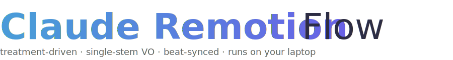
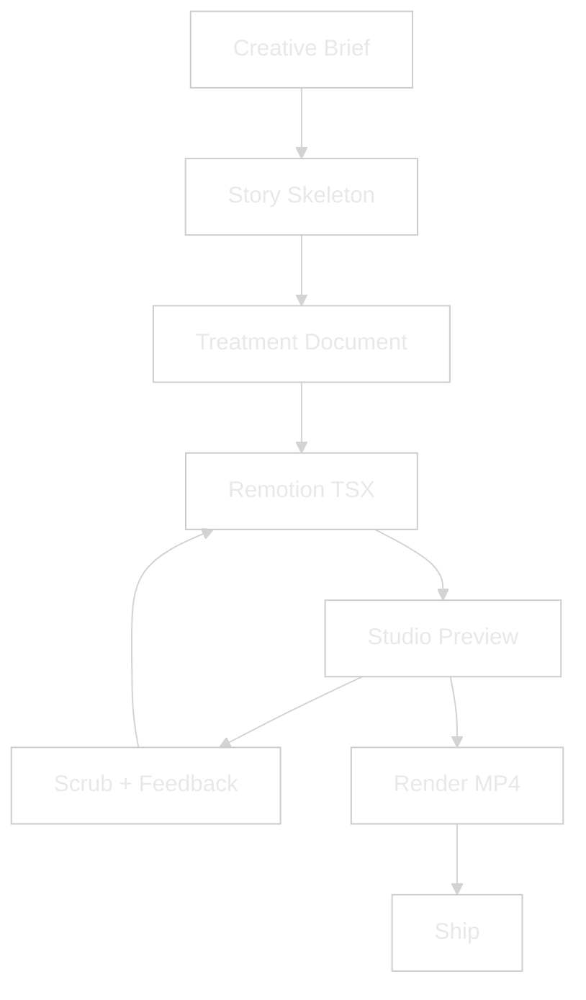
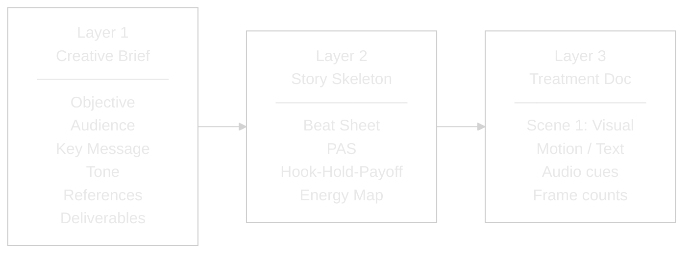
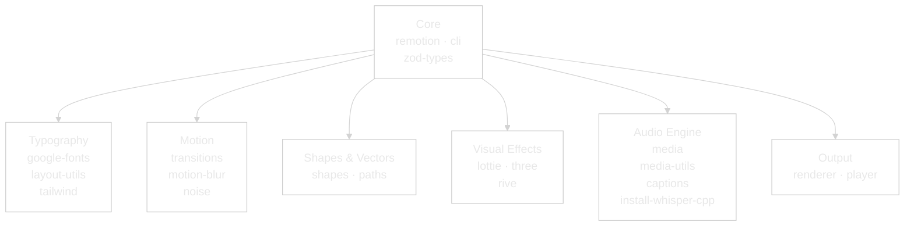
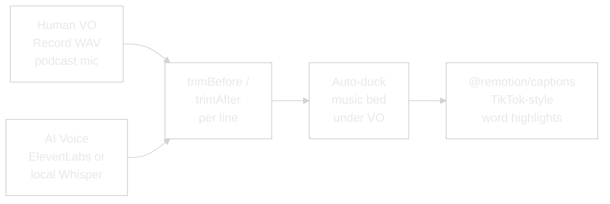
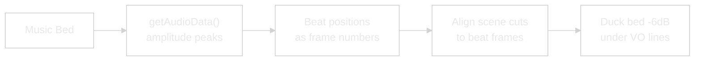

<picture>
  <source media="(prefers-color-scheme: dark)" srcset="assets/logo-dark.svg">
  
</picture>

# Remotion Studio

> Programmatic video production pipeline for SSL 2026 and beyond.
> Treatment-driven, Claude-controlled, beat-synced.

---


---

## WHY — The Problem This Solves

Video production has always been tool-first. Open After Effects, open Premiere, start dragging clips. The creative brief lives in someone's head or a Slack thread. By the time the edit is done, nobody remembers what the video was supposed to *do*.

This system flips it. **The treatment is the source code.** You describe what you want in a structured document — who's watching, what they should feel, what each scene shows, what audio plays when. Claude turns that into Remotion code. Remotion turns that into video. Every frame is a React render, every cut is a function call, every audio duck is a volume curve.

The result: anyone who can describe a video can ship one. No timeline. No keyframes. No After Effects license. Just a treatment and a conversation.

---

## WHAT — System Architecture



### The Treatment System (3 Layers)

Every video follows three layers. Layer 1 captures intent. Layer 2 gives it structure. Layer 3 makes it buildable.



**Layer 2 — Pick based on what the video needs to do:**

| Skeleton | Use When | Beats |
|---|---|---|
| **Beat Sheet** | Telling a story | Hook → Setup → Turn → Proof → Resolve |
| **Problem-Agitate-Solve** | Selling a product | Problem → Agitate → Solve → Outcome |
| **Hook-Hold-Payoff** | Social retention | Hook 3s → Hold 17s → Payoff 10s |
| **Energy Map** | Audio drives the edit | Intro → Build → Drop → Groove → Resolve |

### Package Map



### Directory Structure

```
remotion-demo/
├── src/
│   ├── Root.tsx                 # Composition registry
│   ├── FormatExplainer.tsx      # SSL 2026 opener (1104f / 37s)
│   ├── TreatmentExplainer.tsx   # Treatment framework video (1160f / 38s)
│   └── SSDemo.tsx               # Per-speaker reel template
├── public/
│   ├── ssl-logo.png             # SSL brand mark
│   ├── speakers/                # 5 speaker headshots
│   └── audio/                   # 19 SFX files
│       ├── vasilyatsevich-brain-implant-cyberpunk...  (music bed)
│       ├── soundreality-riser-wildfire...              (riser)
│       ├── alex_kizenkov-aggressive-huge-hit...        (impact)
│       └── ... 16 more (glitch, braam, boom, whoosh)
├── assets/
│   ├── logo-dark.svg            # README header (dark mode)
│   └── logo-light.svg           # README header (light mode)
├── MASTER-LOG.md                # Session history
└── package.json                 # 30 packages, all pinned 4.0.448
```

---

## HOW — Using the System

### 1. Start the Studio

```bash
cd remotion-demo && npm run dev
```

Opens at `localhost:3000`. Select a composition from the dropdown. Scrub the timeline, pause on any frame, hot-reload on code changes.

### 2. Write a Treatment

Start with the Creative Brief (Layer 1):

```markdown
Objective:  Build anticipation for SSL 2026
Audience:   Amazon sellers, 50k+/yr, heard of SSL but uncommitted
Key Message: "This isn't another webinar. It's a working day."
Tone:       Cinematic, urgent, premium, technical
References: Apple WWDC opener, AWS re:Invent countdown
Deliverables: 37s, 16:9 + 9:16 cut
```

Pick a skeleton (Layer 2) — the SSL opener uses **Energy Map** because the cyberpunk music bed drives the edit.

Write the treatment (Layer 3):

```markdown
SCENE 1 — Hook (0:00–0:05, 150f)
  Visual:  "Built for Innovators." static at frame 0, explodes outward f35
  Motion:  spring({ damping: 14, stiffness: 130 }) per word
  Text:    "Not Imitators." drops in f40, chromatic aberration
  Audio:   Riser f0–90, impact hit f92
```

### 3. Claude Builds It

The treatment maps directly to Remotion code:

- **Scenes** → `<TransitionSeries.Sequence>` components
- **Motion notes** → `spring()` / `interpolate()` / easing curves
- **Audio cues** → `<Audio>` layers with `volume`, `trimBefore`, `trimAfter`
- **Text** → styled divs + `@remotion/layout-utils` for auto-fit
- **Timing** → `durationInFrames` calculated from treatment

### 4. Feedback Loop

Scrub in Studio → give timecode feedback ("at frame 72 the flare is too bright") → Claude edits the TSX → Studio hot-reloads → re-scrub. Only render MP4 when signed off.

### 5. Voice Pipeline

Two tracks available:



### 6. Audio Beat-Sync



---

## WHAT IF — Edge Cases & Alternatives

### What if I don't know what video I want?

Start with the **Creative Brief** — specifically the **References** field. Find 2-3 videos that *feel* right and share them. Claude extracts the structure, pace, and tone from references and proposes a skeleton.

### What if the video is audio-first?

Use the **Energy Map** skeleton. Map the music's energy curve (intro → build → drop → groove → resolve), then hang visuals on the peaks. This is how the SSL opener was built — the cyberpunk bed dictated every cut.

### What if I need multiple aspect ratios?

Remotion renders the same composition at any size. One TSX file, multiple outputs:

```bash
npx remotion render --width=1080 --height=1920   # TikTok / Reels
npx remotion render --width=1920 --height=1080   # YouTube / Stage
npx remotion render --width=1080 --height=1080   # Instagram feed
```

Use `@remotion/layout-utils` (`fitText`, `measureText`) to auto-scale text for each ratio.

### What if I want to embed the video on a website?

`@remotion/player` embeds any composition as an interactive React component — no MP4 needed. Viewers can scrub, pause, and the video renders in real time. Works on sellersessions.com.

### What if I need 3D or complex illustrations?

- **Lottie** (`@remotion/lottie`) — After Effects JSON exports. Thousands of free animations on LottieFiles.
- **Three.js** (`@remotion/three`) — Full 3D scenes. Heavy — only when a reel genuinely needs it.
- **Rive** (`@remotion/rive`) — Interactive animations with state machines.

---

## Compositions

| ID | File | Duration | Purpose |
|---|---|---|---|
| `FormatExplainer` | `FormatExplainer.tsx` | 1104f / 37s | SSL 2026 cinematic opener |
| `TreatmentExplainer` | `TreatmentExplainer.tsx` | 1160f / 38s | Treatment framework explainer |
| `SSLSpeaker` | `SSDemo.tsx` | 120f / 4s | Per-speaker reel template |

## SFX Library (19 files)

| Category | Files | Use Case |
|---|---|---|
| **Music bed** | brain-implant-cyberpunk (48.6s) | Full composition underscore |
| **Risers** | riser-wildfire | Scene openers, tension build |
| **Impacts** | aggressive-huge-hit | Logo punches, text hits |
| **Glitch stingers** | 5 files (dragon-studio, pwlpl, virtual_vibes) | Scene transitions |
| **Braams** | 2 files (bryansantosbreton, viralaudio) | Big reveals |
| **Booms** | 3 files (submority, soulprodmusic) | Text impacts |
| **Whooshes** | 2 files (viralaudio, storegraphic) | Camera moves |
| **Other** | 4 files (mega horn, horror tension, futuristic logo, epic cinematic) | Specialty |

## Design Tokens

| Token | Value | Usage |
|---|---|---|
| `BG` | `#0C0322 → #1a1a2e → #461499` | Gradient background |
| `ACCENT` | `#753EF7` | Purple — primary brand |
| `ACCENT_2` | `#FBBF24` | Gold — highlights, CTAs |
| `TEXT` | `#ffffff` | Primary text |
| `TEXT_DIM` | `#a0a0b0` | Secondary text |
| `FONT` | Inter | Body + headings |
| `MONO` | ui-monospace | Code blocks |
| `EASE_OUT` | `bezier(0.16, 1, 0.3, 1)` | Primary easing |
| `TRANS_EASE` | `bezier(0.4, 0, 0.2, 1)` | Transition easing |

---

> **Living system.** Each composition is a React component. Each scene is a function. Each audio cue is a prop. The treatment is the spec, Remotion is the compiler, Studio is the preview, and the MP4 is the artifact.
