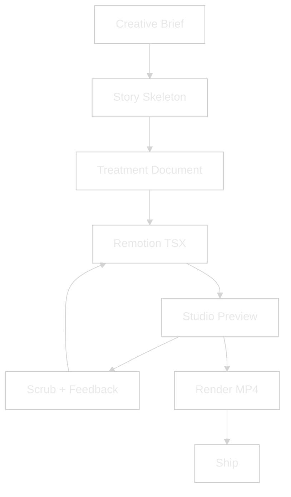
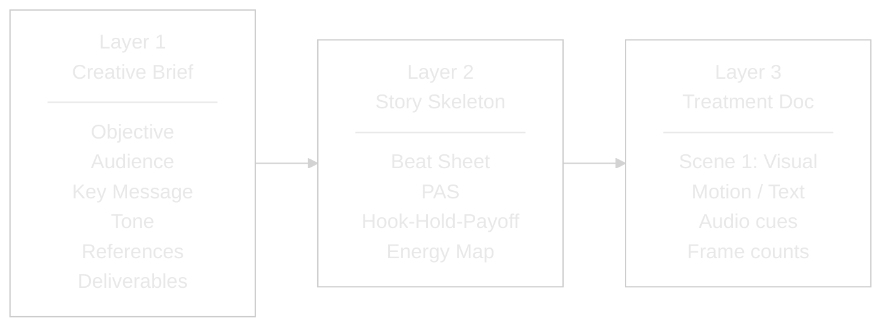
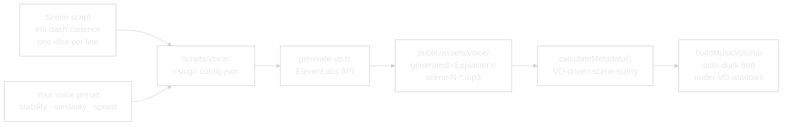
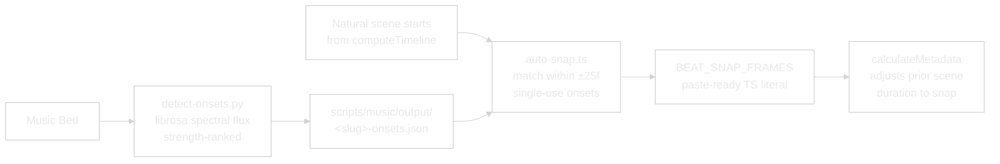

<picture>
  <source media="(prefers-color-scheme: dark)" srcset="assets/logo-dark.svg">
  <source media="(prefers-color-scheme: light)" srcset="assets/logo-light.svg">
  
</picture>

<br/>


**Programmatic video production pipeline.**
**Treatment-driven, Claude-controlled, beat-synced.**

<!-- VIDEOS START -->
### Walkthroughs

<video src="https://github.com/user-attachments/assets/3da20bdd-eaea-4e96-9a10-a15f2e6de9e7" controls muted></video>

**The stack tour.** Remotion, Claude, treatment files, ducking, beat sync. What's under the hood.

<video src="https://github.com/user-attachments/assets/758c1b79-dd45-4228-972d-5e9c89586ad7" controls muted></video>

**Treatment-driven flow.** How a treatment doc becomes a rendered MP4, end to end.
<!-- VIDEOS END -->

> **New here?** The end-to-end recipe lives in [HOW-TO-SHIP-AN-EXPLAINER.md](./HOW-TO-SHIP-AN-EXPLAINER.md) — six steps from treatment to MP4.

---

## Why this exists

Video production has always been tool-first. Open After Effects, open Premiere, start dragging clips. The creative brief lives in someone's head or a Slack thread. By the time the edit is done, nobody remembers what the video was supposed to *do*.

This system flips it. **The treatment is the source code.** You describe what you want in a structured document — who's watching, what they should feel, what each scene shows, what audio plays when. Claude turns that into Remotion code. Remotion turns that into video. Every frame is a React render, every cut is a function call, every audio duck is a volume curve.

The result: anyone who can describe a video can ship one. No timeline. No keyframes. No After Effects license. Just a treatment and a conversation.

---

## Claude Remotion Flow vs Traditional Video Pipelines

| Dimension | After Effects / Premiere | Loom / Descript | Claude Remotion Flow |
|---|---|---|---|
| **Source of truth** | Project file (`.aep` / `.prproj`) | Recording + transcript | Treatment markdown — versioned, diffable, replayable |
| **Animation** | Keyframes by hand | Templates only | `spring()` + `interpolate()` per scene, code-defined |
| **Audio handling** | Manual ducking per clip | Auto-leveling only | `buildMusicVolume()` callback ducks under VO windows |
| **Voice generation** | Record + edit manually | Pre-built voice tools | ElevenLabs cloned voice, regenerated on script change |
| **Beat sync** | Drag clips to peaks manually | Not supported | librosa onset detector + auto-snap helper |
| **Aspect ratios** | Re-edit per ratio | One per recording | Same TSX, render at any size (`--width=` / `--height=`) |
| **Iteration cost** | Re-export per change | Re-record | Hot-reload in Studio, `npm run render` when locked |
| **Collaboration** | `.aep` files in Dropbox | Cloud workspace | Git diff on a treatment doc |
| **License** | Adobe CC subscription | SaaS subscription | MIT (Remotion is free for personal + < $5M revenue) |

---

## What it does



### The Treatment System (3 Layers)

Every video follows three layers. Layer 1 captures intent. Layer 2 gives it structure. Layer 3 makes it buildable.



**Layer 2 — Pick based on what the video needs to do:**

| Skeleton | Use When | Beats |
|---|---|---|
| **Beat Sheet** | Telling a story | Hook → Setup → Turn → Proof → Resolve |
| **Problem-Agitate-Solve** | Selling a product | Problem → Agitate → Solve → Outcome |
| **Hook-Hold-Payoff** | Social retention | Hook 3s → Hold 17s → Payoff 10s |
| **Energy Map** | Audio drives the edit | Intro → Build → Drop → Groove → Resolve |

---

## Ten Things You Can Do With It

The pipeline is treatment-driven — the same engine renders any of these. Differences live in the Creative Brief + skeleton choice.

| # | Pattern | What it looks like |
|---|---------|---------------------|
| 1 | **Explainer video** | Break down a product, concept, or framework. VO narration + on-screen text + motion beats. (The shipped `StackExplainer` + `TreatmentExplainer` are examples.) |
| 2 | **Event opener** | Cinematic 30–40s intro for a conference, launch, or livestream. Music-driven, text-first, impact bookends. |
| 3 | **Product launch video** | Structured hero reveal. Problem → Agitate → Solve skeleton. Punchy VO, animated features, CTA card. |
| 4 | **Data-viz clip** | Animated charts + numbers with narration. Remotion renders SVG / HTML natively — no chart library lock-in. |
| 5 | **Social ad / short** | 30–60s Hook-Hold-Payoff cut for TikTok / Reels / Shorts. Vertical 9:16 render, captions burned or ship alongside. |
| 6 | **Animated quote card** | 6–10s pull-quote asset with gradient, grain, and subtle motion. Perfect for LinkedIn / X. |
| 7 | **Tutorial walkthrough** | Step-by-step with VO + on-screen annotations. Captions auto-generated from the transcript. |
| 8 | **Testimonial video** | VO-led customer story with lower-thirds and b-roll cutaways. Music-ducked under voice. |
| 9 | **Course / module trailer** | 60–90s teaser for an online course. Music-driven pacing, hook-first, CTA close. |
| 10 | **Per-subject reel template** | Short 4–10s intro reel per team member, speaker, or artist. One TSX, data-driven by a JSON/CSV feed. |

Each pattern starts with a Creative Brief, picks a skeleton, writes a treatment, and renders. The engine doesn't change — your inputs do.

---

## Install (via Claude Code)

Paste the repo URL into Claude Code and say:

> "Install Claude Remotion Flow and start the Studio."

Claude will walk you through:

1. **Clone the repo** into a chosen working directory.
2. **Install Node dependencies** — `npm install` pulls 29 Remotion packages + supporting tooling.
3. **Check ffmpeg** — installs via Homebrew (macOS), apt (Linux), or prompts for WSL (Windows). Remotion uses it internally for renders.
4. **Optional: ElevenLabs API key** — paste once, stored in `.env`. Needed only if you want AI-generated voiceover.
5. **Optional: Python + librosa** — sets up a venv for the onset-detection helper. Needed only if you want beat-sync against a music bed.
6. **Start the Studio** — `npm run dev` opens `localhost:3000` with the shipped example compositions loaded.

If the Studio opens and you can scrub the example compositions, the pipeline is working.

### Manual install (if you prefer)

| Tool | Purpose | Install |
|------|---------|---------|
| Node.js 18+ | Runs Remotion | nodejs.org / `brew install node` / `apt install nodejs` |
| `ffmpeg` | Video encoding under the hood | `brew install ffmpeg` (macOS) / `apt install ffmpeg` (Linux) |
| ElevenLabs API key *(optional)* | Cloned-voice VO | Paste into `.env` as `ELEVENLABS_API_KEY` |
| Python 3.12+ + librosa *(optional)* | Beat-sync onset detection | `python -m venv scripts/music/.venv && pip install librosa` |

### First video after install

Once the Studio is running, say to Claude:

> "Help me draft a Creative Brief for a 60-second explainer about *\[your topic\]*."

Claude walks the 3-layer treatment interview, writes the TSX, and you scrub the result in Studio. Render when signed off.

---

## Quick Start (once installed)

```bash
npm run dev            # Open Studio at localhost:3000
npm run render:stack   # Render the example stack explainer
npm run render:treatment   # Render the example treatment explainer
npm run lint           # ESLint + TypeScript typecheck
```

Select a composition from the Studio dropdown. Scrub the timeline, pause on any frame, hot-reload on code changes. Live mixer sliders (`musicHigh`, `musicDuck`, `sfxIntroVolume`, `sfxOutroVolume`) surface in the right-hand Props panel — drag during playback and the render updates frame-by-frame.

---

## How it works

### 1. Write a Treatment

Start with the Creative Brief (Layer 1):

```markdown
Objective:    Explain [your concept] in 60 seconds
Audience:     [who's watching, what they care about]
Key Message:  One-sentence takeaway
Tone:         Cinematic / conversational / technical / punchy
References:   2–3 videos that feel right
Deliverables: 60s, 16:9 + 9:16 cut
```

Pick a skeleton (Layer 2) — Beat Sheet for story, PAS for selling, Hook-Hold-Payoff for social, Energy Map when music drives the edit.

Write the treatment (Layer 3):

```markdown
SCENE 1 — Hook (0:00–0:05, 150f)
  Visual:  Headline text static at frame 0, explodes outward f35
  Motion:  spring({ damping: 14, stiffness: 130 }) per word
  Text:    Supporting line drops in f40, chromatic aberration
  Audio:   Riser f0–90, impact hit f92
```

### 2. Claude Builds It

The treatment maps directly to Remotion code:

- **Scenes** → `<TransitionSeries.Sequence>` components
- **Chapter cards** → `computeTimeline()` interleaves them before target scenes
- **Motion notes** → `spring()` / `interpolate()` / easing curves
- **Audio cues** → `<Audio>` layers with `volume`, `startFrom`, `endAt`
- **Music ducking** → `buildMusicVolume({ voWindows, musicHigh, musicDuck })` callback
- **Text** → styled divs + `@remotion/layout-utils` for auto-fit
- **Timing** → `durationInFrames` computed from VO MP3 lengths via `calculateMetadata`

### 3. Feedback Loop

Scrub in Studio → give timecode feedback ("at frame 72 the flare is too bright") → Claude edits the TSX → Studio hot-reloads → re-scrub. Only render MP4 when signed off.

---

## Voice Pipeline (optional)

One config file per composition, one MP3 per scene. Bring your own ElevenLabs voice — paste the voice ID into a preset file, lock your stability / similarity / speed, and reuse across every video you ship.



**Tips for voice configs:**

- Em-dashes and commas pace the delivery better than SSML breaks.
- One idea per line in the script file — the MP3 output naturally breathes.
- Lock a preset once you've A/B/C-tested your voice. Reuse across every composition for consistency.

---

## Audio Beat-Sync (optional)

Python / librosa detects phrase-level onsets in a music bed. The auto-snap helper picks the ones that land within a safe window of each natural scene start and emits a paste-ready `BEAT_SNAP_FRAMES` literal.



---

## What if...

### ...I don't know what video I want?

Start with **References** in the Creative Brief. Find 2–3 videos that *feel* right, share them. Claude extracts the structure, pace, and tone and proposes a skeleton.

### ...the video is audio-first?

Use the **Energy Map** skeleton. Map the music's energy curve (intro → build → drop → groove → resolve), hang visuals on the peaks.

### ...I need multiple aspect ratios?

Remotion renders the same composition at any size. One TSX, multiple outputs:

```bash
npm run render:stack         # 16:9 default
npx remotion render StackExplainer out/stack-9x16.mp4 --width=1080 --height=1920
npx remotion render StackExplainer out/stack-1x1.mp4  --width=1080 --height=1080
```

Use `@remotion/layout-utils` (`fitText`, `measureText`) to auto-scale text per ratio. Scene bodies already target the canvas via `SAFE_INSET_X/Y` — content scales with the composition.

### ...I want to embed the video on a website?

`@remotion/player` embeds any composition as an interactive React component — no MP4 needed. Viewers can scrub and pause in real time.

### ...I need 3D or complex illustrations?

- **Lottie** (`@remotion/lottie`) — After Effects JSON exports. Thousands of free animations on LottieFiles.
- **Three.js** (`@remotion/three`) — Full 3D scenes. Heavy — only when a reel genuinely needs it.
- **Rive** (`@remotion/rive`) — Interactive animations with state machines.

---

## Directory Structure

```
claude-remotion-flow/
├── src/
│   ├── Root.tsx                    # Composition registry
│   ├── StackExplainer.tsx          # Example: 8-scene explainer
│   ├── TreatmentExplainer.tsx      # Example: 3-layer framework explainer
│   ├── FormatExplainer.tsx         # Example: cinematic event opener
│   └── explainer-shared/           # Shared composition kit
│       ├── constants.ts            # FPS, pre/post-roll, music levels, SFX bookends
│       ├── tokens.ts               # Colors, fonts, safe-area
│       ├── components.tsx          # SceneBG, SceneExit, TRANS, ChapterCard, FadeToBlack
│       ├── timeline.ts             # computeTimeline() — cards + scenes + transitions
│       ├── metadata.ts             # makeCalculateMetadata(), buildMusicVolume(), MixerProps
│       └── sfx-library.ts          # Generated — typed SFX path constants
├── public/assets/
│   ├── voice/
│   │   ├── generated/<Explainer>/  # ElevenLabs MP3 outputs per composition (gitignored)
│   │   └── reference/              # Voice-clone source audio (gitignored)
│   ├── music/                      # Music beds (gitignored — drop your own)
│   ├── sfx/
│   │   ├── library/                # Indexed SFX (MANIFEST.json tracked, MP3s gitignored)
│   │   └── inbox/                  # New scrapes awaiting curation
│   └── branding/                   # Your logos + brand assets
├── scripts/
│   ├── voice/                      # ElevenLabs VO pipeline (generate-vo.ts)
│   ├── music/                      # Onset detection + auto-snap helper
│   └── sfx/                        # Library scraping + auditioner + shortlist-to-code
├── treatments/                     # Per-composition treatment docs
├── out/                            # Rendered MP4 outputs (gitignored)
├── HOW-TO-SHIP-AN-EXPLAINER.md     # End-to-end cookbook
└── package.json                    # 29 packages, Remotion pinned to 4.0.448
```

---

## Example Compositions

The repo ships with three example compositions you can study, modify, or use as starting templates.

| ID | File | Length | Pattern |
|---|---|---|---|
| `StackExplainer` | `StackExplainer.tsx` | ~74s (9 scenes) | Multi-scene concept explainer with VO + music bed |
| `TreatmentExplainer` | `TreatmentExplainer.tsx` | ~38s (6 scenes) | Framework walkthrough, treatment-led |
| `FormatExplainer` | `FormatExplainer.tsx` | ~37s | Cinematic event opener, Energy Map skeleton |

Explainer durations are **VO-driven** — `calculateMetadata` reads each scene's MP3 and sizes the scene to `max(VO + padding, fallback)`. Re-generate the VO and the comp length adjusts automatically.

---

## Audio Library

### SFX — categorised + shortlistable

SFX live under `public/assets/sfx/library/` organised by category. Source of truth is `public/assets/sfx/MANIFEST.json` — one entry per file with title, author, tags, license, and a `shortlisted` flag.

| Category | Typical use |
|---|---|
| `transitions` | whoosh / sweep variants between scenes |
| `stingers` | short logo stings |
| `risers` | cinematic rising tension |
| `impacts` | booms, hits, crashes |
| `ambience`, `music` | backdrops, drones |

**Audition + shortlist workflow:**

```bash
npm run audition                                          # Local auditioner at localhost:3334
node --strip-types scripts/sfx/shortlist-to-code.ts       # Regenerates src/explainer-shared/sfx-library.ts
```

`sfx-library.ts` exports typed constants (`SFX_TRANSITIONS.WHOOSH_CINEMATIC`, etc.) plus a flat `SFX_SHORTLIST_BY_ID` index keyed by stable manifest IDs.

### Music beds

Drop your own into `public/assets/music/<your-bed-collection>/`. Rule: never reuse a bed across videos in the same series. The onset detector (`scripts/music/detect-onsets.py`) ranks phrase-level beats per bed so you can beat-sync without ear-balling timestamps.

### SFX bookends — the cinematic envelope

Every explainer is wrapped in a pre-roll + post-roll envelope with a whoosh intro and cinematic boom outro:

| Slot | Purpose | Volume prop |
|---|---|---|
| Intro whoosh | Opens the video | `sfxIntroVolume` (live slider) |
| Outro boom | Closes the video | `sfxOutroVolume` (live slider) |
| Music bed | Full-length atmospheric bed | `musicHigh` / `musicDuck` (live sliders) |

---

## Design Tokens

All tokens live in `src/explainer-shared/tokens.ts` — import from `./explainer-shared` anywhere in `src/`. Override per composition or swap globally to rebrand.

| Token | Default | Usage |
|---|---|---|
| `BG` | Deep purple gradient | Scene background |
| `ACCENT` | `#753EF7` | Primary brand accent |
| `ACCENT_2` | `#FBBF24` | Highlights, CTAs |
| `ACCENT_3` | `#22d3ee` | Data viz, waveforms |
| `TEXT` | `#ffffff` | Primary text |
| `TEXT_DIM` | `#a0a0b0` | Secondary text |
| `FONT` | Inter | Body + headings |
| `MONO` | ui-monospace | Code blocks |
| `EASE_OUT` | `bezier(0.16, 1, 0.3, 1)` | Primary easing |
| `TRANS_EASE` | `bezier(0.4, 0, 0.2, 1)` | Transition easing |
| `SAFE_INSET_X` | `120` (6.25% of 1920) | Horizontal safe-area |
| `SAFE_INSET_Y` | `80` (7.4% of 1080) | Vertical safe-area |
| `CANVAS_W` / `CANVAS_H` | `1920 × 1080` | Default composition size |
| `GRAIN_SVG` | inline data-URL | Subtle film grain overlay |

**Safe-area rule:** fill the canvas, don't top-align. Scene bodies stretch to near `SAFE_INSET_*` on all sides — let content drift slightly over the edge rather than clustering in the upper third.

---

## npm Scripts

| Script | What it does |
|---|---|
| `npm run dev` | Launch Remotion Studio on `localhost:3000` |
| `npm run build` | Bundle the project for renders |
| `npm run lint` | ESLint + TypeScript typecheck |
| `npm run render:stack` | Render StackExplainer → `out/StackExplainer.mp4` |
| `npm run render:treatment` | Render TreatmentExplainer → `out/TreatmentExplainer.mp4` |
| `npm run audition` | Local SFX auditioner on `localhost:3334` (browse + shortlist) |
| `npm run library:migrate` | Migrate MANIFEST.json to the latest schema |
| `npm run library:render` | Render a human-readable library index |

---

## Helper Scripts

| Script | Purpose |
|---|---|
| `scripts/voice/generate-vo.ts` | ElevenLabs VO generator — reads a per-composition config JSON, emits MP3s. Supports `--dry-run` for cost estimates. |
| `scripts/music/detect-onsets.py` | librosa onset detector — ranks phrase starts in a music bed. |
| `scripts/music/auto-snap.ts` | Auto-snap helper — emits a `BEAT_SNAP_FRAMES` literal from onsets + natural scene starts. |
| `scripts/sfx/shortlist-to-code.ts` | Shortlist → code — regenerates `src/explainer-shared/sfx-library.ts` from MANIFEST.json shortlisted items. |
| `scripts/sfx/pixabay-scrape.mjs` | SFX library scraper — pulls new items into `public/assets/sfx/inbox/`. |
| `scripts/sfx/merge-inbox-to-library.mjs` | Promotes inbox items to the categorised library + indexes into MANIFEST.json. |

---

## Live Mixer

Each explainer's schema exposes four mixer props as live sliders in the Studio Props panel:

| Prop | Default | Range | Effect |
|---|---|---|---|
| `musicHigh` | `0.16` | `0 – 1` | Music-bed volume at rest |
| `musicDuck` | `0.06` | `0 – 1` | Music-bed volume during VO |
| `sfxIntroVolume` | `0.45` | `0 – 1` | Intro whoosh level |
| `sfxOutroVolume` | `0.55` | `0 – 1` | Outro boom level |

Drag any slider during playback — the render updates live, no code changes needed. Defaults live in `DEFAULT_MIXER` (`src/explainer-shared/metadata.ts`); overrides sit in each composition's `defaultProps` in `src/Root.tsx`.

Remotion renders numeric schema props as `InputDragger` (drag-scrub). Step increments come from `.multipleOf()` on the Zod schema — the shipped examples use `0.05` for ~20 meaningful steps across the `0–1` range.

---

## Build Timeline

| Milestone | What |
|---|---|
| Sessions 1–8 | SFX pipeline — scrape + audition + categorise. MANIFEST-driven library with shortlist-to-code helper. |
| Sessions 9–11 | First explainers — TreatmentExplainer (3-layer treatment system) + StackExplainer (multi-scene). Beat-sync via librosa onsets. |
| Session 12 | Live mixer via Zod schema. HOW-TO-SHIP-AN-EXPLAINER cookbook. Auto-snap helper. Shortlist-to-code generator. |
| Sessions 13–14 | Production spine refactor — single-stem VO + peak limiter + factory hardening. Studio-tuned mixer defaults. |
| Sessions 15–16 | Audio polish — surgical fades, music bed wired-on, ducker decommissioned. Intro chapter factory + visual override. |
| Session 17 | Workshop video factory + V2 split + WorkshopOverview (chapter-mode VO with timings sidecar). |
| Sessions 18-19 | README polish: 4th badge, vs-traditional comparison table, Build Timeline + Repos cross-link, gradient text logo SVG pair (dark/light) wired via `<picture>`. |
| Session 20 | Loop Cutter v2 (DJ chip-row workflow) + Seller Sessions rebrand pass + Wave 1 Loom strip-back. |
| Session 21 | `SOURCE-OF-TRUTH.md` consolidation (882 lines, ducking dead globally) + `ClaudeUiWorkflowExplainer` end-to-end build. |
| Session 22 | UmbrellaTutorial audio finish: Loom VO loudnormed (-25.8 to -15.9 LUFS) + `HOUSE_DEFAULT` bed at 0.10 inline + two unnatural Loom welds cut surgically (-5.62s) + render (4:38, 35 MB). |

---

## Companion repos

This repo ships with two siblings: same author, same operating principles, different production surface.

| Repo | What it does |
|---|---|
| [`claude-video-editing-flow`](https://github.com/sellersessions/claude-video-editing-flow) | Selection-led short-form cuts. Drop a video, tick candidates in markdown, render. |
| [`claude-ui-workflow`](https://github.com/sellersessions/claude-ui-workflow) | Design intelligence pipeline. 10 stages from brand brief to production UI. |

All three are designed to run alongside [`ClaudeFlow-Agent`](https://github.com/sellersessions/ClaudeFlow-Agent), the personal AI operating system that ties them together.

---

> **Living system.** Each composition is a React component. Each scene is a function. Each audio cue is a prop. The treatment is the spec, Remotion is the compiler, Studio is the preview, and the MP4 is the artifact.
