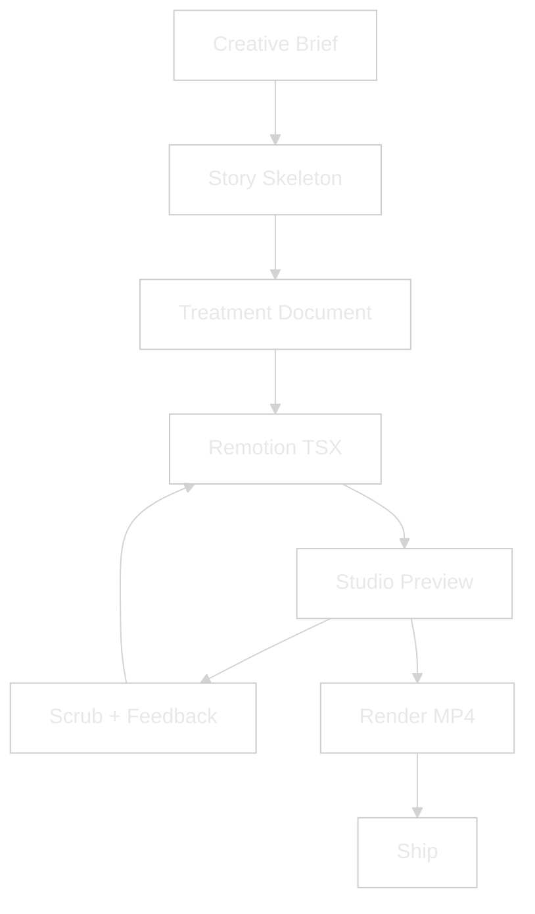
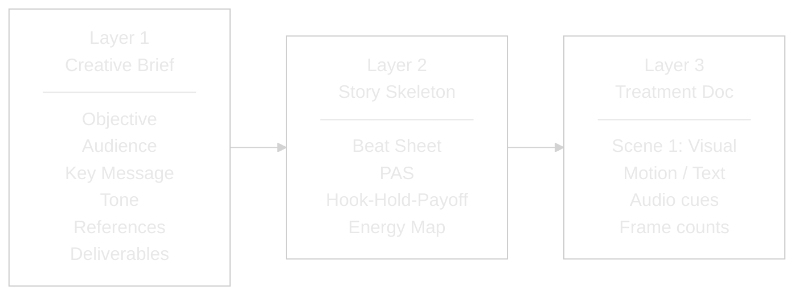
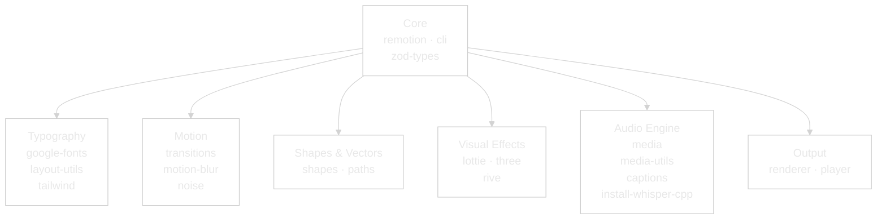
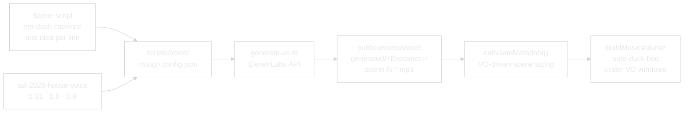
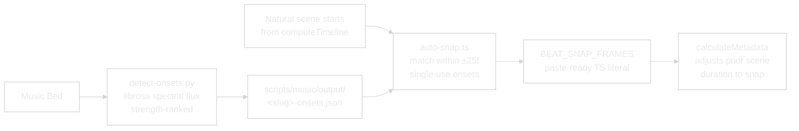

<picture>
  <source media="(prefers-color-scheme: dark)" srcset="assets/logo-dark.svg">
  
</picture>

# Remotion Studio

> Programmatic video production pipeline for SSL 2026 and beyond.
> Treatment-driven, Claude-controlled, beat-synced.

---


> **New here?** The end-to-end recipe lives in [HOW-TO-SHIP-AN-EXPLAINER.md](./HOW-TO-SHIP-AN-EXPLAINER.md) — six steps from treatment to MP4.

---

## WHY — The Problem This Solves

Video production has always been tool-first. Open After Effects, open Premiere, start dragging clips. The creative brief lives in someone's head or a Slack thread. By the time the edit is done, nobody remembers what the video was supposed to *do*.

This system flips it. **The treatment is the source code.** You describe what you want in a structured document — who's watching, what they should feel, what each scene shows, what audio plays when. Claude turns that into Remotion code. Remotion turns that into video. Every frame is a React render, every cut is a function call, every audio duck is a volume curve.

The result: anyone who can describe a video can ship one. No timeline. No keyframes. No After Effects license. Just a treatment and a conversation.

---

## WHAT — System Architecture



### The Treatment System (3 Layers)

Every video follows three layers. Layer 1 captures intent. Layer 2 gives it structure. Layer 3 makes it buildable.



**Layer 2 — Pick based on what the video needs to do:**

| Skeleton | Use When | Beats |
|---|---|---|
| **Beat Sheet** | Telling a story | Hook → Setup → Turn → Proof → Resolve |
| **Problem-Agitate-Solve** | Selling a product | Problem → Agitate → Solve → Outcome |
| **Hook-Hold-Payoff** | Social retention | Hook 3s → Hold 17s → Payoff 10s |
| **Energy Map** | Audio drives the edit | Intro → Build → Drop → Groove → Resolve |

### Package Map



### Directory Structure

```
claude-remotion-flow/
├── src/
│   ├── Root.tsx                    # Composition registry
│   ├── FormatExplainer.tsx         # SSL 2026 opener
│   ├── TreatmentExplainer.tsx      # 3-layer framework explainer
│   ├── StackExplainer.tsx          # The production stack explainer
│   ├── SSDemo.tsx                  # Per-speaker reel template
│   └── explainer-shared/           # Shared skeleton (Session 11 extract)
│       ├── constants.ts            # FPS, pre/post-roll, music levels, SFX bookends
│       ├── tokens.ts               # Colors, fonts, safe-area
│       ├── components.tsx          # SceneBG, SceneExit, TRANS, ChapterCard, FadeToBlack
│       ├── timeline.ts             # computeTimeline() — cards + scenes + transitions
│       ├── metadata.ts             # makeCalculateMetadata(), buildMusicVolume(), MixerProps
│       └── sfx-library.ts          # Generated — typed SFX path constants
├── public/assets/
│   ├── voice/
│   │   ├── generated/<Explainer>/  # ElevenLabs MP3 outputs per composition
│   │   └── reference/              # Voice-clone source audio
│   ├── music/ssl-live-beds/        # 4 ambient cinematic beds
│   ├── sfx/
│   │   ├── library/                # 378 indexed SFX (MANIFEST.json)
│   │   └── inbox/                  # New scrapes awaiting curation
│   ├── speakers/                   # Speaker headshots
│   └── branding/                   # SSL logos
├── scripts/
│   ├── voice/                      # ElevenLabs VO pipeline (generate-vo.ts)
│   ├── music/                      # Onset detection + auto-snap helper
│   └── sfx/                        # Library scraping + auditioner + shortlist-to-code
├── treatments/                     # Per-composition treatment docs
├── out/                            # Rendered MP4 outputs
├── HOW-TO-SHIP-AN-EXPLAINER.md     # End-to-end cookbook
├── MASTER-LOG.md                   # Session history
└── package.json                    # 29 packages, Remotion pinned to 4.0.448
```

---

## HOW — Using the System

### 1. Start the Studio

```bash
cd claude-remotion-flow && npm run dev
```

Opens at `localhost:3000`. Select a composition from the dropdown. Scrub the timeline, pause on any frame, hot-reload on code changes. Live mixer sliders (`musicHigh`, `musicDuck`, `sfxIntroVolume`, `sfxOutroVolume`) surface in the right-hand Props panel — drag during playback and the render updates frame-by-frame.

### 2. Write a Treatment

Start with the Creative Brief (Layer 1):

```markdown
Objective:  Build anticipation for SSL 2026
Audience:   Amazon sellers, 50k+/yr, heard of SSL but uncommitted
Key Message: "This isn't another webinar. It's a working day."
Tone:       Cinematic, urgent, premium, technical
References: Apple WWDC opener, AWS re:Invent countdown
Deliverables: 37s, 16:9 + 9:16 cut
```

Pick a skeleton (Layer 2) — the SSL opener uses **Energy Map** because the cyberpunk music bed drives the edit.

Write the treatment (Layer 3):

```markdown
SCENE 1 — Hook (0:00–0:05, 150f)
  Visual:  "Built for Innovators." static at frame 0, explodes outward f35
  Motion:  spring({ damping: 14, stiffness: 130 }) per word
  Text:    "Not Imitators." drops in f40, chromatic aberration
  Audio:   Riser f0–90, impact hit f92
```

### 3. Claude Builds It

The treatment maps directly to Remotion code:

- **Scenes** → `<TransitionSeries.Sequence>` components
- **Chapter cards** → `computeTimeline()` interleaves them before target scenes
- **Motion notes** → `spring()` / `interpolate()` / easing curves
- **Audio cues** → `<Audio>` layers with `volume`, `startFrom`, `endAt`
- **Music ducking** → `buildMusicVolume({ voWindows, musicHigh, musicDuck })` callback
- **Text** → styled divs + `@remotion/layout-utils` for auto-fit
- **Timing** → `durationInFrames` computed from VO MP3 lengths via `calculateMetadata`

### 4. Feedback Loop

Scrub in Studio → give timecode feedback ("at frame 72 the flare is too bright") → Claude edits the TSX → Studio hot-reloads → re-scrub. Only render MP4 when signed off.

### 5. Voice Pipeline

One config file per composition, eight MP3s out. ElevenLabs Pro clone (`Danny Raw Voice 2026`), SSL 2026 house-voice preset locked at 0.31 stability / 1.0 similarity / 0.9 speed.



### 6. Audio Beat-Sync

Python/librosa detects phrase-level onsets in the music bed. The auto-snap helper picks the ones that land within a safe window of each natural scene start and emits a paste-ready `BEAT_SNAP_FRAMES` literal.



---

## WHAT IF — Edge Cases & Alternatives

### What if I don't know what video I want?

Start with the **Creative Brief** — specifically the **References** field. Find 2-3 videos that *feel* right and share them. Claude extracts the structure, pace, and tone from references and proposes a skeleton.

### What if the video is audio-first?

Use the **Energy Map** skeleton. Map the music's energy curve (intro → build → drop → groove → resolve), then hang visuals on the peaks. This is how the SSL opener was built — the cyberpunk bed dictated every cut.

### What if I need multiple aspect ratios?

Remotion renders the same composition at any size. One TSX file, multiple outputs:

```bash
npm run render:stack         # Stack explainer → out/StackExplainer.mp4 (16:9)
npm run render:treatment     # Treatment explainer → out/TreatmentExplainer.mp4

# Ad-hoc aspect ratios via the CLI:
npx remotion render StackExplainer out/stack-9x16.mp4 --width=1080 --height=1920
npx remotion render StackExplainer out/stack-1x1.mp4  --width=1080 --height=1080
```

Use `@remotion/layout-utils` (`fitText`, `measureText`) to auto-scale text per ratio. Scene bodies already target the canvas via `SAFE_INSET_X/Y` — the content scales with the composition.

### What if I want to embed the video on a website?

`@remotion/player` embeds any composition as an interactive React component — no MP4 needed. Viewers can scrub, pause, and the video renders in real time. Works on sellersessions.com.

### What if I need 3D or complex illustrations?

- **Lottie** (`@remotion/lottie`) — After Effects JSON exports. Thousands of free animations on LottieFiles.
- **Three.js** (`@remotion/three`) — Full 3D scenes. Heavy — only when a reel genuinely needs it.
- **Rive** (`@remotion/rive`) — Interactive animations with state machines.

---

## Compositions

| ID | File | Target length | Purpose |
|---|---|---|---|
| `StackExplainer` | `StackExplainer.tsx` | ~74s (9 scenes) | How the 18-plugin production stack works |
| `TreatmentExplainer` | `TreatmentExplainer.tsx` | ~38s (6 scenes) | 3-layer briefing framework |
| `FormatExplainer` | `FormatExplainer.tsx` | ~37s | SSL 2026 cinematic opener |
| `SSLSpeaker` | `SSDemo.tsx` | 4s | Per-speaker reel template |

Explainer durations are **VO-driven** — `calculateMetadata` reads each scene's MP3 and sizes the scene to `max(VO + padding, fallback)`. Re-generate the VO and the comp length adjusts automatically.

## Audio Library

### SFX — 378 indexed items, 18 shortlisted

All SFX live under `public/assets/sfx/library/` organised by category. The source of truth is `public/assets/sfx/MANIFEST.json` — one entry per file with title, author, tags, license, and a `shortlisted` flag.

| Category | In library | Shortlisted |
|---|---|---|
| `transitions` | whoosh / sweep variants | 9 |
| `stingers` | short logo stings | 1 |
| `risers` | cinematic rising tension | 5 |
| `impacts` | booms, hits, crashes | 3 |
| `ambience`, `music` | backdrops, drones | — |

**Audition + shortlist workflow:**

```bash
npm run audition                                         # Local auditioner at localhost:3334
node --strip-types scripts/sfx/shortlist-to-code.ts       # Regenerates src/explainer-shared/sfx-library.ts
```

`sfx-library.ts` exports typed constants (`SFX_TRANSITIONS.WHOOSH_CINEMATIC`, etc.) plus a flat `SFX_SHORTLIST_BY_ID` index keyed by stable manifest IDs.

### Music beds — 4 ambient cinematic tracks

Located in `public/assets/music/ssl-live-beds/`. Rule: never reuse a bed across videos in the same series. The onset detector (`scripts/music/detect-onsets.py`) ranks phrase-level beats per bed.

### SFX bookends — the cinematic envelope

Every explainer is wrapped in a pre-roll + post-roll envelope with a whoosh intro and cinematic boom outro:

| Slot | Default file | Volume prop |
|---|---|---|
| Intro whoosh | `pixabay-ksjsbwuil-whoosh-8-*.mp3` | `sfxIntroVolume` (live slider) |
| Outro boom | `pixabay-universfield-impact-cinematic-boom-*.mp3` | `sfxOutroVolume` (live slider) |
| Music bed | per-composition pick from `ssl-live-beds/` | `musicHigh` / `musicDuck` (live sliders) |

## Design Tokens

All tokens live in `src/explainer-shared/tokens.ts` — import from `./explainer-shared` anywhere in `src/`.

| Token | Value | Usage |
|---|---|---|
| `BG` | `#0C0322 → #1a1a2e → #461499` | Gradient background |
| `ACCENT` | `#753EF7` | Purple — primary brand |
| `ACCENT_2` | `#FBBF24` | Gold — highlights, CTAs |
| `ACCENT_3` | `#22d3ee` | Cyan — data viz, waveforms |
| `TEXT` | `#ffffff` | Primary text |
| `TEXT_DIM` | `#a0a0b0` | Secondary text |
| `FONT` | Inter | Body + headings |
| `MONO` | ui-monospace | Code blocks |
| `EASE_OUT` | `bezier(0.16, 1, 0.3, 1)` | Primary easing |
| `TRANS_EASE` | `bezier(0.4, 0, 0.2, 1)` | Transition easing |
| `SAFE_INSET_X` | `120` (6.25% of 1920) | Horizontal safe-area target |
| `SAFE_INSET_Y` | `80` (7.4% of 1080) | Vertical safe-area target |
| `CANVAS_W` / `CANVAS_H` | `1920 × 1080` | Default composition size |
| `GRAIN_SVG` | inline data-URL | Subtle film grain overlay |

**Safe-area rule:** fill the canvas, don't top-align. Scene bodies stretch to near `SAFE_INSET_*` on all sides — let content drift slightly over the edge rather than clustering in the upper third.

## npm Scripts

| Script | What it does |
|---|---|
| `npm run dev` | Launch Remotion Studio on `localhost:3000` |
| `npm run build` | Bundle the project for renders |
| `npm run lint` | ESLint + TypeScript typecheck |
| `npm run render:stack` | Render StackExplainer → `out/StackExplainer.mp4` |
| `npm run render:treatment` | Render TreatmentExplainer → `out/TreatmentExplainer.mp4` |
| `npm run audition` | Local SFX auditioner on `localhost:3334` (browse + shortlist) |
| `npm run library:migrate` | Migrate MANIFEST.json to the latest schema |
| `npm run library:render` | Render a human-readable library index |

## Helper Scripts

| Script | Purpose |
|---|---|
| `scripts/voice/generate-vo.ts` | ElevenLabs VO generator — reads a per-composition config JSON, emits MP3s. Supports `--dry-run` for cost estimates. |
| `scripts/music/detect-onsets.py` | librosa onset detector — ranks phrase starts in a music bed. |
| `scripts/music/auto-snap.ts` | Auto-snap helper — emits a `BEAT_SNAP_FRAMES` literal from onsets + natural scene starts. |
| `scripts/sfx/shortlist-to-code.ts` | Shortlist → code — regenerates `src/explainer-shared/sfx-library.ts` from MANIFEST.json shortlisted items. |
| `scripts/sfx/pixabay-scrape.mjs` | SFX library scraper — pulls new items into `public/assets/sfx/inbox/`. |
| `scripts/sfx/merge-inbox-to-library.mjs` | Promotes inbox items to the categorised library + indexes into MANIFEST.json. |

## Live Mixer

Each explainer's schema exposes four mixer props as live sliders in the Studio Props panel:

| Prop | Default | Range | Effect |
|---|---|---|---|
| `musicHigh` | `0.16` | `0 – 1` | Music-bed volume at rest |
| `musicDuck` | `0.06` | `0 – 1` | Music-bed volume during VO |
| `sfxIntroVolume` | `0.45` | `0 – 1` | Intro whoosh level |
| `sfxOutroVolume` | `0.55` | `0 – 1` | Outro boom level |

Drag any slider during playback — the render updates live, no code changes needed. Defaults live in `DEFAULT_MIXER` (`src/explainer-shared/metadata.ts`); overrides sit in each composition's `defaultProps` in `src/Root.tsx`.

---

> **Living system.** Each composition is a React component. Each scene is a function. Each audio cue is a prop. The treatment is the spec, Remotion is the compiler, Studio is the preview, and the MP4 is the artifact.
